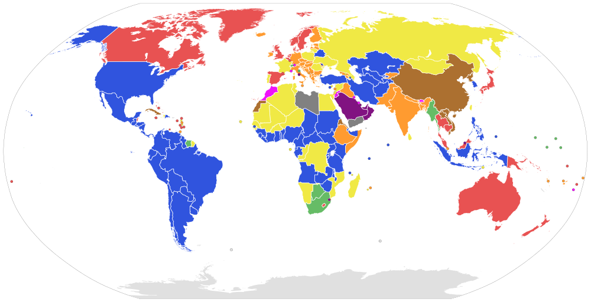
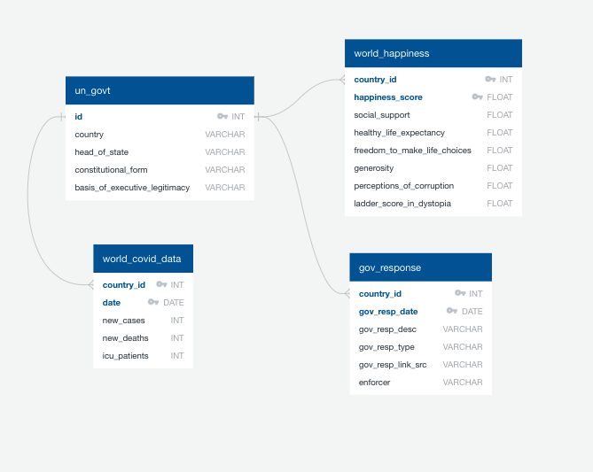
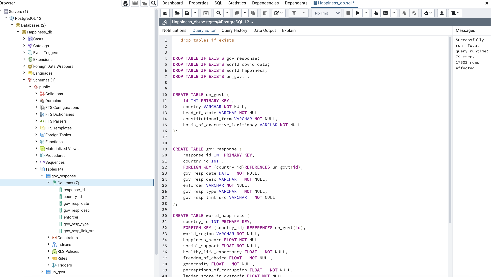
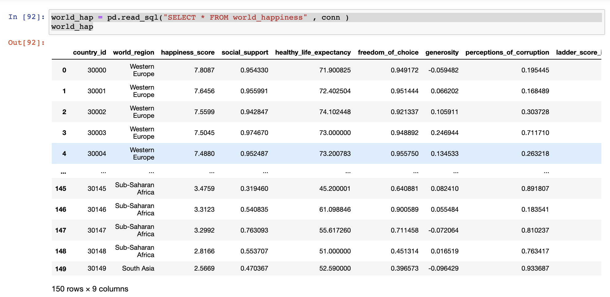
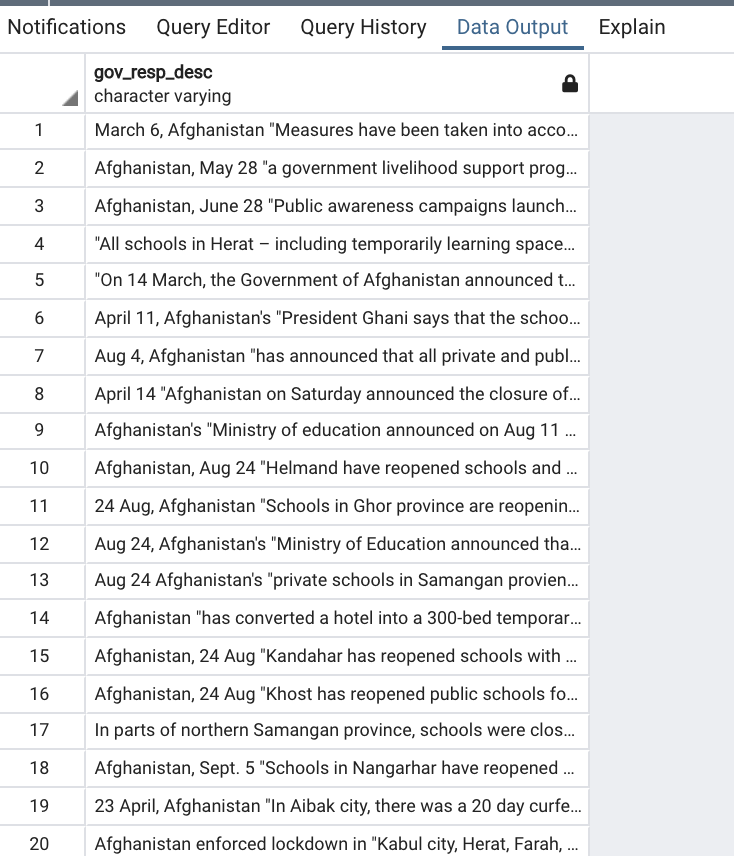

# etl-project-team4

# World Happiness and Covid
Members: Avery Croley, Karen Pearson, Tamara Washington

 

### **Project Overview**
The Covid-19 pandemic has changed the world in unimaginable ways. It is arguable the worse pandemic the world has seen in 100 years. No aspect of life was left untouched including work, schools, social impacts and the economy. 

Our Covid 19 Happiness Database complies data from countries around the world and can be used to see how Covid-19 factors affect the happiness score of that population.

Queries our database can answer;

- What type of government had the happiest/unhappiest outcome during the year with Covid-19?
- What countries were the happiest/unhappiest because of the governments positive/negative actions due to Covid-19.
- Which type of governments and countries did the best to reduce the number of deaths/cases due to Covid-19?

---
### **Extract**
[World Happiness Report 2020](https://www.kaggle.com/londeen/world-happiness-report-2020 "World Happiness Report 2020")

This CSV file contains the Happiness Score for 153 countries along with the factors used to explain the score. The Happiness Score is a national average of the responses to the main life evaluation question asked in the Gallup World Poll (GWP).

[List of countries by system of government](https://en.wikipedia.org/wiki/List_of_countries_by_system_of_government "List of countries by system of government")

This is a table of countries by systems of government. Wikipedia.org was scraped and read into a dataframe using Pandas. 

~~~Python
link = "https://en.wikipedia.org/wiki/List_of_countries_by_system_of_government"
tables = pd.read_html(link,header=0)
~~~


[Our World in Data COVID-19 Dataset](https://ourworldindata.org/coronavirus-source-data "Our World in Data COVID-19 Dataset")

This document reports and visualizes the data on confirmed cases and deaths from Johns Hopkins University.


[COVID-19 Government Responses](https://data.world/liz-friedman/covid-19-government-responses-coronanet-research-project "COVID-19 Government Responses")

The CoronaNet Research Project aims to collect as much information as possible about the various fine-grained actions governments are taking to defeat the coronavirus. This is made available in CSV format.

---
## **Transform**
All CSV and HTML files were read into Jupyter Notebook to transform our datasets. 

To address data integrity we;

1. Organized our data sets using an ERD Diagram from [Quick Database Diagrams](https://www.quickdatabasediagrams.com/) website
  
- Reviewed the files and normalized the data by having Primary keys and Foreign Keys for each table. We decided that the data had to have a connection by id and country; and so we created a country id.
  
2. In jupyter notebook, we imported pandas, numpy, datetime, sqlalchemy to clean up our datasets. We first read the data and created dataframes. Basically, we performed the following for all tables: 
- Using df.drop(), we dropped countries - to keep it consistent with other datasets -> some countries were removed due to lack of data.
- Country names were standardized to be consistent across all tables.
- Using df.fillna(), NaN values were replaced 
- Using .count(), we kept track of the number of rows in each column.
- Specifically, we performed the following: 

#### Government

1. Read the data using pd.read_html()
2. Updated country names - to keep it consistent with other datasets using df.rename()
3. Using df.fillna(), NaN values were replaced -> list of countries wiki where there was "no constitutionally-defined basis to current regime"
4. Using df.reset_index(), we reset the index 
5. added an id column with unique numbers using pandas, this would become the primary care share throughout each dataset.

#### World Happiness 

1. pd.read_csv()
2. Dropped columns not needed
3. Renamed columns to fit ERD
4. Renamed country names - to keep it consistent with other datasets
5. Merged country id column from government dataframe with happiness dataframe
6. Replace NaN and 0
7. Removed 2021 dates
8. Converted dtypes to int and datetime

#### Covid data

1. pd.read_csv()
2. Dropped columns not needed
3. Renamed columns to fit ERD
4. Renamed country names - to keep it consistent with other datasets
5. Merged country id column from government dataframe with happiness dataframe

#### COVID-19 Government Responses

1. pd.read_csv()
2. Dropped columns that were not in our ERD
3. Dropped rows that did not contain a https link
4. Kept rows that had contained an enforcer type.
5. Dropped rows with empty cells in all columns.
6. Kept the last row of duplicates
7. Renamed columns to keep with ERD format
8. Removed unique values within cell string
9. Delete rows that have countries not in other datasets, to keep it consistent.
10. Merged dataframes to keep same country id as other datasets
11. Dropped rows with NaN values
12. Replaced object type with either Int64 or Datetime64


---

## **Load**

First, using pgAdmin we created our table [schema](sql_files/Happiness_db.sql). In [jupyter notebook](etl_prpject_final_notebook.ipynb), we executed each dataframe to sql using ```df.to_sql()```. This action imported our database into in the newly created tables we made in postgres. Finally, we checked if the data had imported in to pgAdmin correctly. 


---

### **Sources of Data:**
- Kaggle - https://www.kaggle.com/londeen/world-happiness-report-2020
- Wikipedia - https://en.wikipedia.org/wiki/List_of_countries_by_system_of_government
- Our World in Data - https://ourworldindata.org/coronavirus-source-data
- Data.World-csv - https://data.world/liz-friedman/covid-19-government-responses-coronanet-research-project
