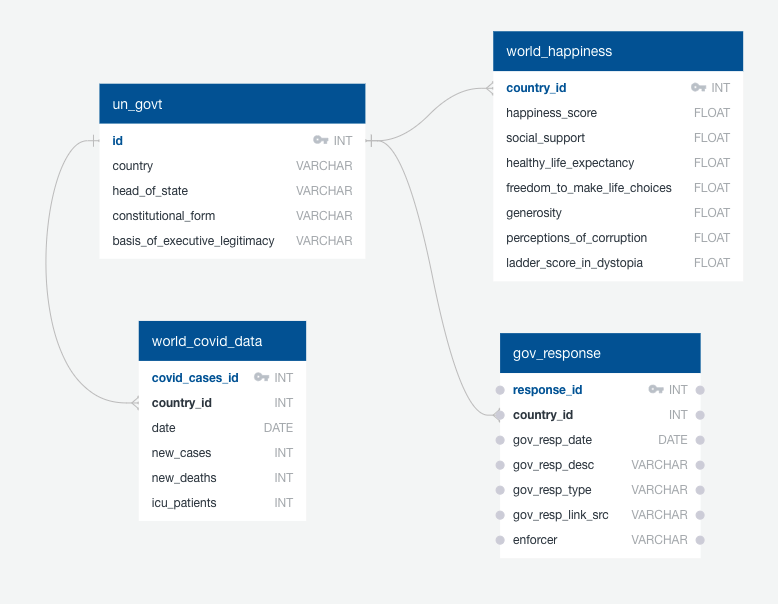

# etl-project-team4

# World Happiness and Covid
Members: Avery Croley, Karen Pearson, Tamara Washington

 

### **Project Overview**
The Covid-19 pandemic has changed the world in unimaginable ways. It is arguable the worse pandemic the world has seen in 100 years. No aspect of life was left untouched including work, schools, social impacts and the economy. 

Our Covid 19 Happiness Database complies data from countries around the world and can be used to see how Covid-19 factors affect the happiness score of that population.

Queries our database can answer;

- What type of government had the happiest/unhappiest outcome during the year with Covid-19?
- What countries were the happiest/unhappiest because of the governments positive/negative actions due to Covid-19.
- Which type of governments and countries did the best to reduce the number of deaths/cases due to Covid-19?

---
### **Extract**
[World Happiness Report 2020](https://www.kaggle.com/londeen/world-happiness-report-2020 "World Happiness Report 2020")

This CSV file contains the Happiness Score for 153 countries along with the factors used to explain the score. The Happiness Score is a national average of the responses to the main life evaluation question asked in the Gallup World Poll (GWP).

[List of countries by system of government](https://en.wikipedia.org/wiki/List_of_countries_by_system_of_government "List of countries by system of government")

This is a table of countries by systems of government. Wikipedia.org was scraped and read into a dataframe using Pandas. 

~~~Python
link = "https://en.wikipedia.org/wiki/List_of_countries_by_system_of_government"
tables = pd.read_html(link,header=0)
~~~

[Our World in Data COVID-19 Dataset](https://ourworldindata.org/coronavirus-source-data "Our World in Data COVID-19 Dataset")

This document reports and visualizes the data on confirmed cases and deaths from Johns Hopkins University.

[COVID-19 Government Responses](https://data.world/liz-friedman/covid-19-government-responses-coronanet-research-project "COVID-19 Government Responses")

The CoronaNet Research Project aims to collect as much information as possible about the various fine-grained actions governments are taking to defeat the coronavirus. This is made available in CSV format.

---
### **Transform**
All CSV and HTML files were read into Jupyter Notebook to transform our datasets. 

To address data integrity we;

- Reviewed the files and transformed into data frames. 
- Some countries were removed due to lack of data.
- Country names were standardized to be consistent across all tables.
- Replaced null values on the list of countries wiki where there was "no constitutionally-defined basis to current regime"

---

### **Load**

We started by reviewing our data and constructing an ERD and established tables and columns. An engine was constructed to be connect with postgres and we loaded the data into a schema named Happiness_db.sql in pgAdmin.

---

### **Sources of Data:**
- Kaggle - https://www.kaggle.com/londeen/world-happiness-report-2020
- Wikipedia - https://en.wikipedia.org/wiki/List_of_countries_by_system_of_government
- Our World in Data - https://ourworldindata.org/coronavirus-source-data
- Data.World-csv - https://data.world/liz-friedman/covid-19-government-responses-coronanet-research-project
